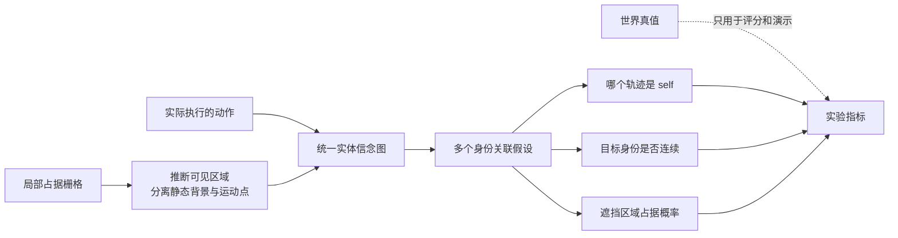
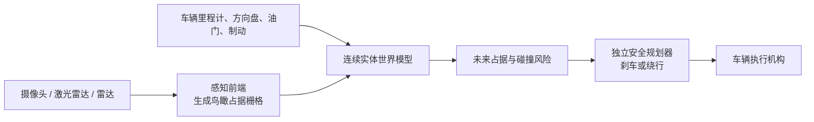

最关键的结论是：

> 当前系统不是一个“会开车的端到端神经网络”，而是一个在线更新的、结构化概率世界模型。它学习“哪些观测属于同一实体、哪个实体是自己、实体被遮挡后可能在哪里”。它目前不会自己决定刹车或转向。

## 1. 当前学习器到底如何实现

可以把它想成一个保安，通过摄像头观察几个外观完全相同的人：

- 某个人总是跟着我的遥控指令移动——更可能是“自己”；
- 另外的人按照各自的运动规律移动；
- 某个人走到墙后面，不代表他消失了；
- 两个人重合时先保留多个猜测，等他们分开后再判断身份。



具体分成四步。

### 第一步：把墙和运动目标分开

系统看到的不是“汽车 A”“行人 B”，而只是一个 `11×11` 的二值格子：

```text
0 = 没看到占据
1 = 看到这里有东西
```

前端根据连续观测判断：

- 长期不动的占据格更像墙；
- 会移动的格子更像实体；
- 被墙挡住的区域属于“未知”，不是“已确认为空”。

对应实现是 [entity_belief_graph.py](/Users/ziy/Code/ClayCosmos/CalModel/cal/model/entity_belief_graph.py:91)。

### 第二步：同时保留几个可能解释

两个目标交叉、重合或进入遮挡时，系统不会马上断言：

> 左边的一定是 ID 7，右边的一定是 ID 9。

它最多保留 5 个完整解释，例如：

- 假设一：A 是 ID 7，B 是 ID 9；
- 假设二：A 是 ID 9，B 是 ID 7；
- 假设三：其中一个目标是新出现的实体。

随后根据运动是否连续、重新出现的位置、动作是否匹配等证据调整权重。实现入口在 [entity_belief_graph.py](/Users/ziy/Code/ClayCosmos/CalModel/cal/model/entity_belief_graph.py:173)。

这就是身份交叉后不容易立即串号的原因。

### 第三步：通过动作相关性识别“自己”

每个实体都记录两类在线统计：

- `P(位移 | 动作)`：给出某个动作后，它通常怎么移动；
- `P(位移)`：不考虑动作时，它本来怎么移动。

如果某条轨迹长期表现为：

```text
向左动作 → 它向左
向右动作 → 它向右
向上动作 → 它向上
```

它的 self 概率就会上升。

这不是预先告诉系统“ID 3 是自己”，而是通过动作与视觉变化的对应关系识别。self 后验计算在 [entity_belief_graph.py](/Users/ziy/Code/ClayCosmos/CalModel/cal/model/entity_belief_graph.py:562)。

### 第四步：遮挡时继续预测实体

目标被挡住后，系统不会继续获得目标位置。它根据此前学到的：

- 位置；
- 速度；
- 运动方向概率；
- 存在概率；
- 多个身份假设；

推算目标可能在哪里。

如果那个位置只是不可见，存在概率缓慢下降；如果系统确实看到了那个位置为空，概率才快速下降。最终把多个假设合成为占据概率图，实现在 [entity_belief_graph.py](/Users/ziy/Code/ClayCosmos/CalModel/cal/model/entity_belief_graph.py:644)。

## 2. 为什么可视化会出现现在的效果

seed 30000 的结果是：

| 条件 | self F1 | 身份一致性 | 遮挡目标概率 |
|---|---:|---:|---:|
| Formal | 0.9477 | 0.9536 | 0.9131 |
| No action | 0.0000 | 0.9507 | 0.9135 |
| Shuffled action | 0.0000 | 0.9507 | 0.9131 |
| Assume all visible | 0.8662 | 0.5362 | 0.0169 |

它们分别说明了不同的因果关系。

### 为什么去掉动作后，self F1 变成 0

目标仍然可以根据运动连续性被跟踪，所以身份一致性依然较高。

但系统不知道“哪个目标的运动是由我控制的”，因此不能可靠区分 self 和其他移动目标。

这说明：

> 身份跟踪和自我识别不是一回事。

### 为什么把动作错开 5 步也会失败

动作仍然存在，但时间不对应：

```text
现在看到的移动 ← 配到了五步以前的动作
```

于是动作与视觉变化之间的因果关系被破坏，self 证据无法积累。

这排除了“系统只是发现某个目标移动得比较多”这种解释。

### 为什么 Assume all visible 会丢失遮挡目标

该条件把没有看到的区域当成“已经看过，而且为空”。

于是目标一进入墙后，系统就认为：

> 我检查过那个位置，那里没有目标。

隐藏目标概率因此从 Formal 的 `0.9131` 降到 `0.0169`。

这说明对象永久性不是页面画出来的效果，而确实依赖“不可见”和“可见为空”的区别。

### 哪些东西是人工设计，哪些是学到的

人工设计的是：

- 使用实体图；
- 最多保留 5 个假设；
- 如何更新概率和计数；
- 静态背景阈值；
- self 输出阈值；
- 资源上限。

在线学到的是：

- 哪些观测属于同一个实体；
- 每个实体的运动规律；
- 动作与实体位移的对应关系；
- 哪个 ID 更可能是 self；
- 遮挡后实体可能在哪里；
- 各个关联假设的相对权重。

因此，更准确的说法是：

> 我们设计了学习机制和归纳偏置；系统通过无标签时序经验填充具体的实体、运动和 self 信念。

## 3. 如何迁移到自动驾驶避让

不能直接拿当前版本接管真实车辆，因为目前存在三个差距：

1. 输入是占据栅格，不是原始摄像头；
2. 动作只有停、左、右、上、下五种离散动作；
3. 输出是世界信念，不是刹车或方向盘控制。

正确的系统边界应当是：



当前项目只实现了中间的“实体世界模型”原型。

## 4. 最适合的第一个真实场景

建议不要先测试普通跟车，而是测试：

> 前方厢式货车遮挡了一个此前短暂可见的行人或车辆。

示例过程：

1. 自车以 30 km/h 行驶；
2. 行人在货车边缘短暂出现；
3. 行人进入货车遮挡区；
4. 行人继续向车道移动；
5. 自车需要在行人重新出现前开始减速。

这里必须让目标先出现过一次。当前系统能够维持“见过但被遮挡”的实体，却不能凭空预测一个从未被任何传感器看到过的人。

需要比较四套完全相同的车辆和规划器：

- Formal 世界模型；
- 不提供自车运动；
- 错时自车运动；
- 假设所有区域都可见；
- 还可以增加一个“完全没有对象永久性”的普通检测器。

这样如果 Formal 更早制动，就能说明改进来自世界模型，而不是换了规划器。

## 5. 建议的验证阶梯

### 第一层：真实数据离线回放

使用公开自动驾驶数据，把 LiDAR 转成鸟瞰占据栅格，把自车位姿变化作为动作输入。

Waymo Open Motion Dataset 当前提供大量带轨迹 ID、地图和自车轨迹的驾驶片段，适合先检查身份连续性和运动预测，但离线数据不能验证车辆采取新动作后的闭环结果。[Waymo Open Dataset](https://waymo.com/open/about/)

这一层验证：

- 遮挡后是否保留正确 ID；
- 重新出现后是否找回同一实体；
- 隐藏位置概率是否校准；
- 是否产生大量“幽灵目标”。

### 第二层：CARLA 闭环仿真

这是我最推荐的下一步。

CARLA 能提供相机、深度、LiDAR、雷达、IMU、碰撞检测等传感器，也有 recorder 和 Scenario Runner，适合重复生成同一个避让场景。[CARLA 官方介绍](https://carla.readthedocs.io/en/latest/start_introduction/)、[传感器说明](https://carla.readthedocs.io/en/latest/ref_sensors/)

第一版建议使用语义 LiDAR生成占据图，先隔离“世界模型是否有效”这个问题。通过后再换普通 LiDAR，最后才是摄像头视觉。

### 第三层：封闭场地 shadow mode

把模型放到真实车辆上，但只记录：

- 它认为哪里有目标；
- 它何时建议制动；
- 实际驾驶员做了什么。

不允许模型控制方向盘、油门和制动。

### 第四层：封闭场地安全控制

在软目标、假人、遥控制动车辆和独立急停系统下，让一个经过验证的安全规划器读取模型输出。

公开道路是最后阶段。NHTSA 的自动驾驶测试框架也把验证分布在建模/仿真、封闭场地和开放道路等层次，而不是直接从原型跳到公路控制。[NHTSA 自动驾驶测试资料](https://www.nhtsa.gov/automated-vehicles-safety/published-reports-and-documents)

## 6. 真正要验收哪些指标

不要只看“有没有撞车”。至少要同时记录：

- 遮挡期间目标召回率；
- 重新出现后的身份恢复率；
- 身份交换次数；
- 隐藏占据概率的 Brier score 或 NLL；
- 碰撞率；
- 最小 TTC；
- 首次制动时间；
- 最大减速度和 jerk；
- 没有危险时的误刹率；
- 同一场景多 seed 的稳定性。

训练、calibration、validation、holdout 还应按照地图、天气、车辆类型和场景族隔离，而不只是换随机 seed。否则同一条道路稍微换个位置，仍可能属于数据泄漏。

最合理的下一步不是“接入真实 Tesla FSD”，而是：

> 在 CARLA 中建立“遮挡目标进入车道”的可重复场景，用当前 I1 作为世界模型、用固定安全规划器做制动，然后用四个对照条件验证它是否真正增加了避让时间裕量。

这既延续当前项目已经验证的能力，也不会把“对象永久性”误说成“已经具备自动驾驶能力”。
